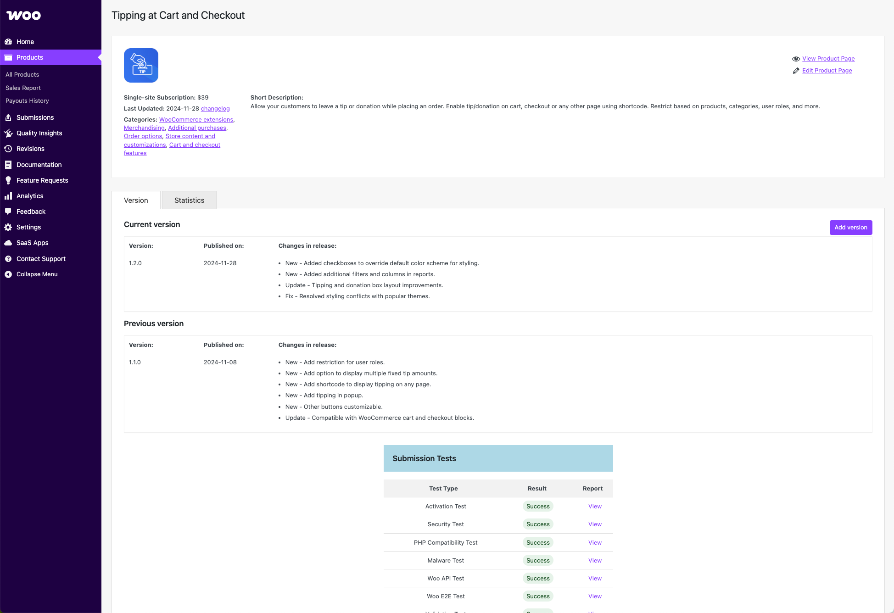
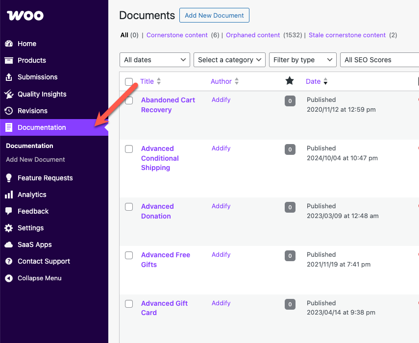

# Managing products in the Woo Marketplace

Developers selling in the WooCommerce.com Marketplace can edit their product pages, access information like usage data and sales, and manage reviews.

## Editing a product page

Most of the work for managing products can be done via the [vendor dashboard](https://woocommerce.com/wp-admin/).

- From your vendor dashboard, navigate to _Products > All Products_.
- Select the product you want to work on.

From there, you can see information about usage, upload a new version, or edit the product page. [Review our product page guidelines](https://woocommerce.com/document/marketing-product-pages-writing/).

### Uploading new versions

To maintain a high-quality and competitive Marketplace, we encourage all vendors to regularly update their products. Consistent updates ensure compatibility with the latest versions of WooCommerce and WordPress, improve security and performance, and deliver ongoing value to customers.

[Review our product update guidelines and best practices](https://woocommerce.com/document/product-update-guidelines/).

### Adding or editing documentation

To review, edit, or add documentation, navigate to _Documentation_ in your vendor dashboard. [Review our guidelines for creating effective documentation](https://woocommerce.com/document/writing-documentation/).

## Understanding product sales

Vendors have access to reports on how their products are performing, including:

- **Earnings**: New sales, renewal sales, and refund amount.
- **Commissions**: The amount the vendor earns from **net** product sales. Net revenue is defined as **revenue received from extension purchases minus refunds, chargebacks, disputes, discounts, and affiliate fees**.
- **Subscriptions**: Total active subscriptions, including new and renewing this month, as well as refund and renewal rates.

To view this information, log in to your vendor dashboard and navigate to _Analytics > Overview_.

