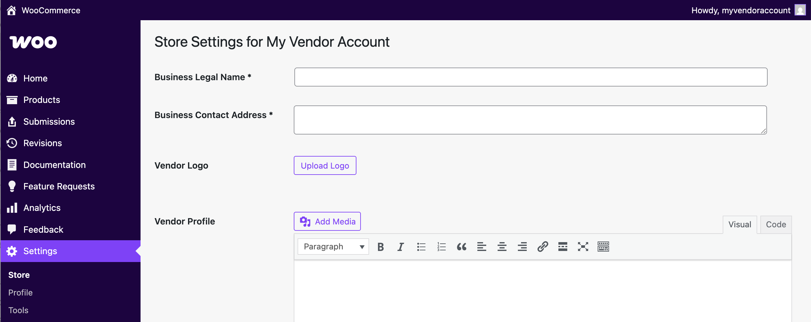
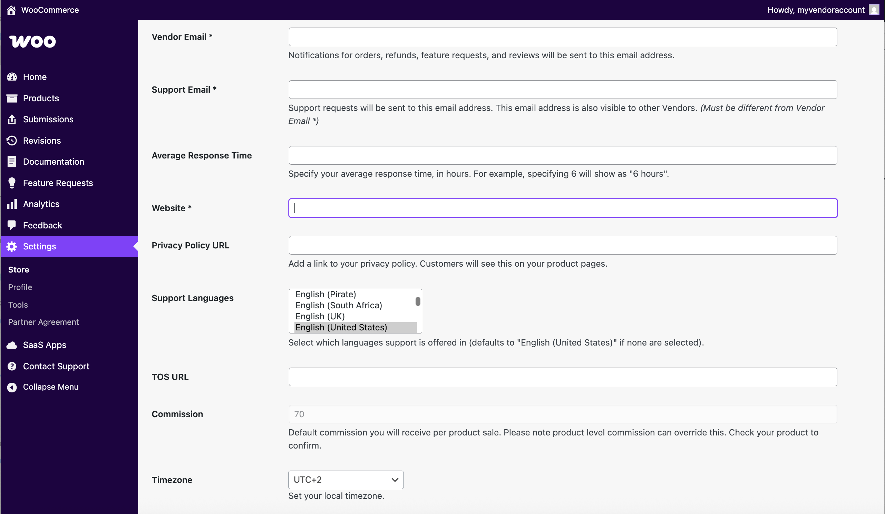
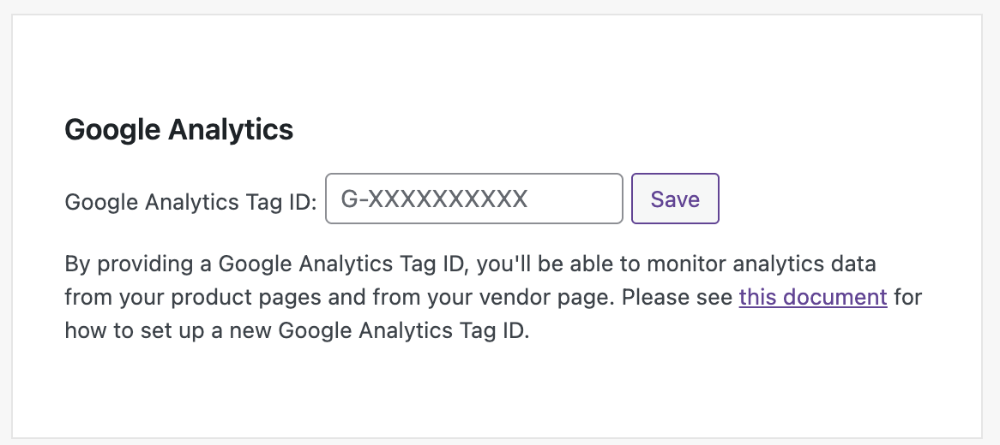

# Manage your Woo Marketplace partner account

Partners selling on the Woo Marketplace can edit their store profile and update their support email from the Partner dashboard. For some changes, we ask that you contact the Marketplace team for help.

To access store settings, click the **Store** menu under **_Settings_** in your [partner dashboard](https://woocommerce.com/wp-admin/).

## Business legal name and contact address

When you first join the WooCommerce Marketplace, we'll ask you to complete the **_Business Legal Name_** and **_Business Contact Address_** fields. These allow us to set up an account for you on our accounting platform so you can get paid for your extension sales.

If you make changes to the business name, you'll see a prompt to resign the **Partner Agreement**. Please click on **Partner Agreement** in the left menu, scroll down and tick the box to agree, then save. If the business name changes to a new entity after you have started selling, we will reach out about setting up a new accounting profile.

To change your vendor name, [please contact us](https://woocommerce.com/wp-admin/admin.php?page=wcpv-vendor-support).

## Vendor logo and profile

Your vendor logo and profile are a great way to tell more about yourself and your company to prospective customers! This will appear at the public profile for your brand along with your extensions.

- **Do:** Upload a logo for your company that **does not include** the [WooCommerce brand or trademark](https://woocommerce.com/trademark-guidelines/).
- **Do:** Tell your brand story. Why are you a great WooCommerce partner?
- **Do:** Link to your website homepage (optional). Use the same URL listed in your vendor profile if you opt to include it.
- **Don't:** Link to other products you sell outside of WooCommerce.com.
- **Don't:** Link to another contact form other than the **[WooCommerce.com contact page](https://woocommerce.com/my-account/contact-support/).**

## Other settings

**Required settings:**

- **Vendor email:** Where we send updates about orders and any other communication.
- **Support email:** The address that will receive support and presales requests.
- **Website:** Your company's website. This will not be displayed on your vendor profile.

**Optional settings:**

- **Average response time:** List in hours, not currently shown on profiles.
- **Privacy policy URL:** A link to the privacy policy on your website.
- **Support Languages:** Languages in which you offer support.
- **TOS URL:** A link to the terms of service on your website.
- **Timezone:** Timezone setting, not displayed.

## Tools

Additional tools to help you with vendor information are available in **[Settings > Tools](https://woocommerce.com/wp-admin/admin.php?page=partner-dashboard-tools)** in the vendor dashboard.

### Google Analytics

Add your own Google Analytics tag to your vendor dashboard to get insights on the pages for your products and profile. [Follow these steps](https://wordpress.com/support/google-analytics/#step-1-sign-up-to-google-analytics) for information on how to sign up and get your Tag ID.

### Customer subscription details

Type in a customer email and press **enter** to verify their account owns your product and qualifies for support.

### Vendor details

Need to know how to reach another vendor? Type the vendor name and hit Enter to see their support email address.

### Changelog validator

Test your `changelog.txt` file to ensure that it meets [Woo Marketplace standards](https://woocommerce.com/document/create-a-plugin/#section-9) by copying the text of the file and pasting it into the text box. You can also use our ChatGPT [Changelog Formatter](https://chatgpt.com/g/g-9b3SlOWTF-woocommerce-com-changelog-formatter) to automatically revise your existing changelog to use in your extension.

## FAQs

How can I add someone to help me manage my products?

- We can add additional Vendor Admins to your profile at your request. Vendor Admins can assist with updating products and documentation as well as view sales reports, reviews, and feature requests.
- To request another admin, [contact us via the link in your dashboard](https://woocommerce.com/wp-admin/admin.php?page=wcpv-vendor-support) or email [partners@woocommerce.com](mailto:partners@woocommerce.com) using your current partner account email. Please first ensure that they have [created a WooCommerce.com account](https://woocommerce.com/sso?new=1&next=%2Fwoocommerce%2F) with [two-step authentication enabled](https://wordpress.com/support/security/two-step-authentication/).

