# Product page content and assets

This document is designed to walk you through each step of editing your product page, detailing the assets you'll need and offering a few recommendations to maximize its effectiveness. Whether you're introducing a new product or refining an existing listing, the success of your page hinges on a clear, engaging, and user-friendly presentation.

## Editing the product page

1. Log in to your [Vendor Dashboard](https://woocommerce.com/wp-admin/).
2. Navigate to _Products > [All Products](https://woocommerce.com/wp-admin/edit.php?post_type=product)_.
3. Select the product you want to work on.

From there, you can see information about usage, upload a new version, or edit the product page.

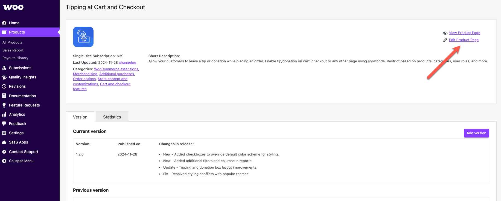

## Product icon

The product icon is the key visual element in all occurrences of your product in the Woo Marketplace. The image should be:

- **The logo of your product, not your brand.** For example, a Gmail extension would display a Gmail logo icon, not the Google logo.
- A **160×160px** image file in JPG or PNG format.
- The image is displayed at 80x80px, so please mind legibility. We recommend logos/symbols rather than text that would be too small to read.
- Please keep the icon content inside the **112×112px** area. This region of the image is unlikely to be hidden from view.
- We use the `border-radius` property to define the radius of the icon's corners, so please don't add rounded corners to your image.

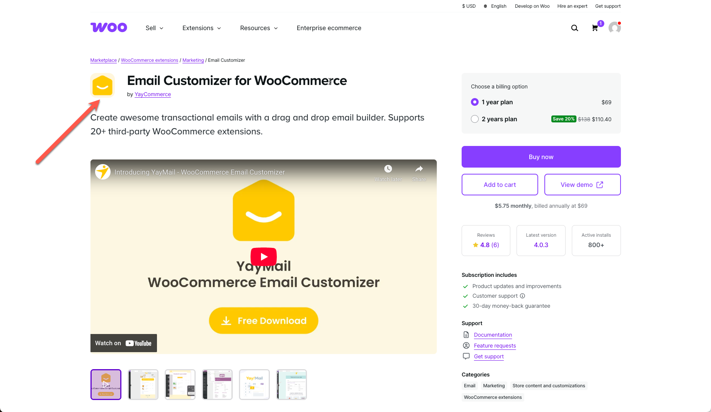

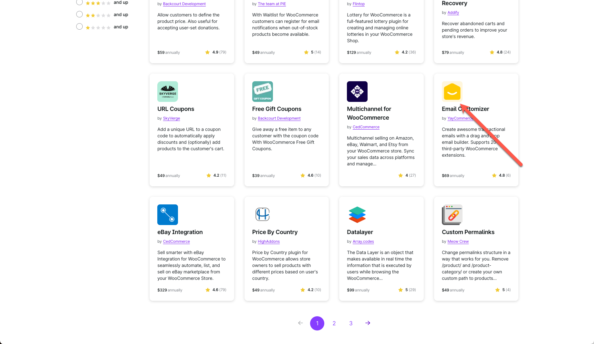

- Upload it under _Product Data > Woo Product Data > Product Icon_.

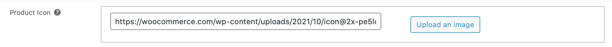

- If a non-transparent image is used, please be sure to update the background color accordingly.

## Highlight card

The highlight card background color sits behind the product icon and is applied to special placements across WooCommerce.com (see the example below from the Marketplace homepage):

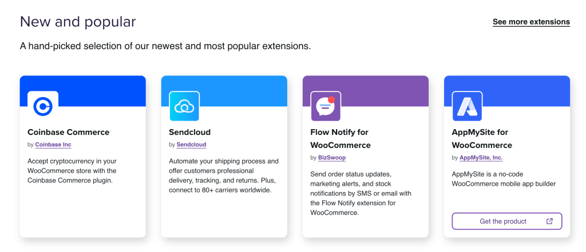

Provide a hex color code under _Product Data > Woo Product Data > Highlight card background color_.

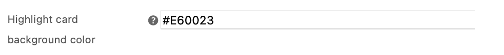

## Product thumb

Product thumbs are used for themes and business services. It is not necessary to add one for extensions.

- The minimum image size is 555x416px.
- Reusing the featured image is acceptable.

## Short description

Keep it short and powerful. Besides the product page, the short description is also used in the product card, or the excerpt Google uses in the search results page.

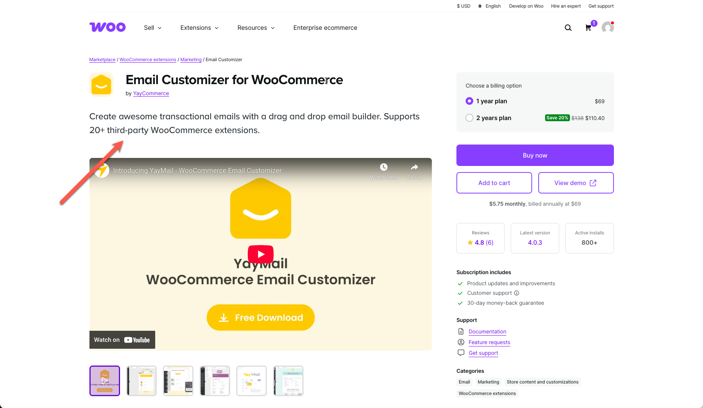

To add/edit the short descriptions, when editing a product, scroll down to the bottom of the screen.

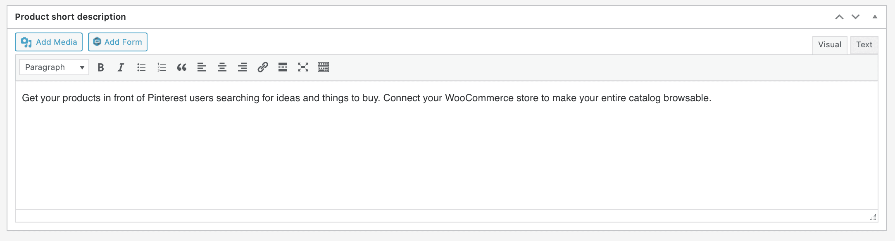

## Gallery

The media gallery gives you the opportunity to put your product in its best light. We recommend using it for as much as possible.

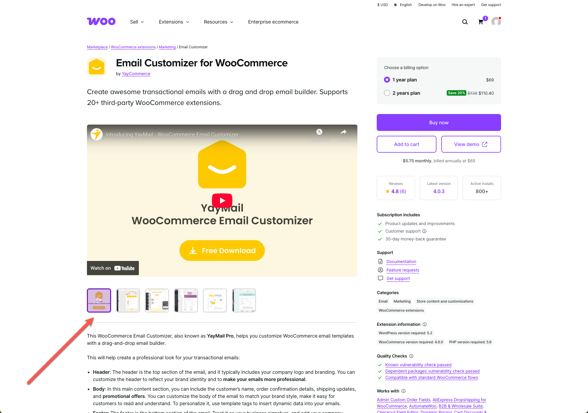

### Images

Images should be:

- 896×550 px or larger

To upload images, use the native WooCommerce gallery in the product editor, as described in the image above, and always start with the Featured Image.

### Video

The gallery supports one embeddable video per product (e.g. YouTube, Vimeo). If there's a video attached, it will always show as the first item in the gallery.

To embed a video, when editing a product, scroll down to the _Product Data_ section and click the _Featured Video_ tab. Paste in your video's embed code and click _Update_.

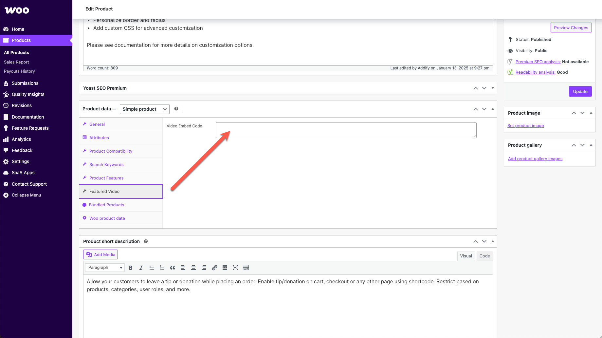

## Product description

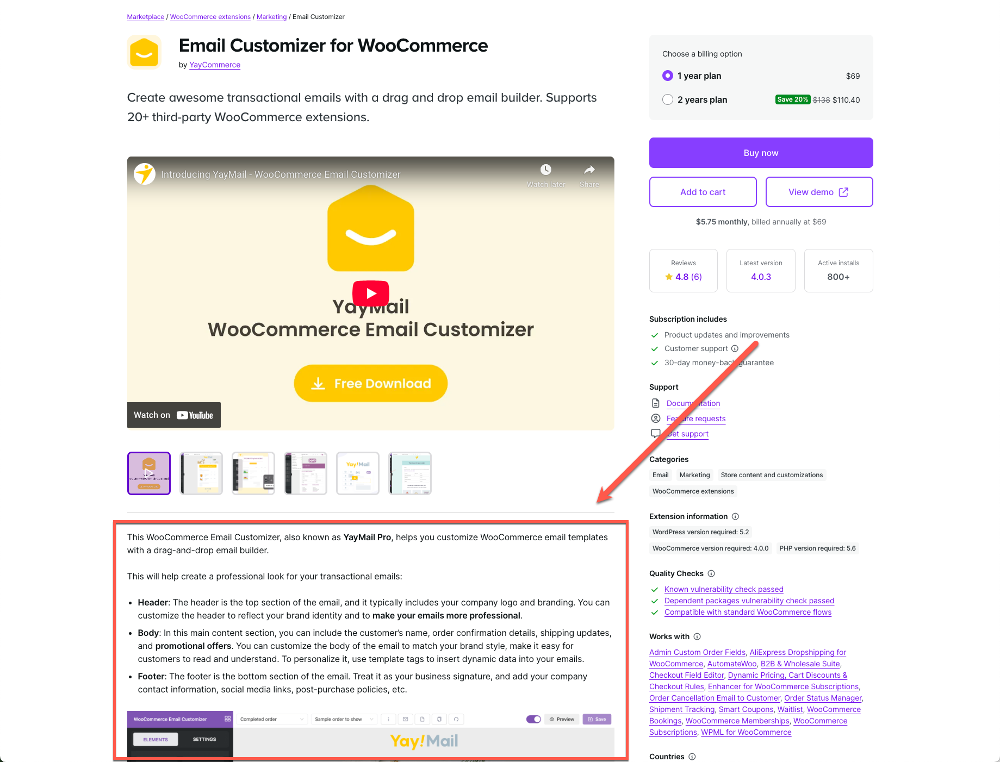

When creating product pages, it's essential to communicate effectively, ensuring the content is accessible and engaging for everyone. The description gives you the most opportunity to highlight what's valuable about your product from a customer's perspective. Here are a few recommendations to help you get the best of it:

- **Optimize for AI** ― By using a direct, factual tone and clear headings that answer "what is" and "how-to." This helps generative engines cite your content as the definitive answer to a user's question.
- **Focus on Sales, Not Specs** ― Design your description to highlight key benefits, keeping technical details for documentation. This approach helps customers understand the value of your product without getting bogged down by complexity.
- **Start With Top Benefits** ― Lists are not only easy to scan but also make your most compelling selling points stand out, ensuring they're memorable and immediately accessible. A 3-5 points list format allows users to quickly understand the unique advantages your product delivers.
- **Explain Like I'm 5** ― Aim to present your products in a way that anyone, even a beginner, can understand. Simplify your explanations without compromising the message, making sure concepts are broken down into fundamental, easy-to-grasp ideas.
- **Sell the Hole, Not the Drill** ― Remember, customers are looking for solutions, not specifications. Start with the benefits your product offers, then mention the features. For instance, instead of leading with "This phone case is made of carbon fibers," highlight "Protect your phone from any fall with our ultra-durable case." It's about solving problems, not listing specifications.
- **Simple and Clear Language** ― Use plain, straightforward language that avoids industry jargon and complex terms. Break down elaborate concepts into simple explanations. This approach makes your content accessible to beginners and experts alike, ensuring everyone understands the value of your products.
- **Visual Aids and Examples** ― Leverage diagrams, screenshots, and examples to illustrate your points. Visual aids can turn abstract concepts into tangible ideas, making them easier to grasp. Leave the screenshots showcasing the settings screens or other technical parts for the documentation.
- **Empathy and Understanding** ― Acknowledge the challenges users might face, offering reassurance and support to boost their confidence in using your products.

Please do not use/paste in emojis.

See more about formatting in our [Marketplace Content Style Guide](/docs/woo-marketplace/content-style-guide/).

## FAQs

Frequently asked questions (FAQs) are incredibly valuable for potential customers, helping to clarify common pre-purchase questions and boosting customer confidence in your extensions. A well-crafted FAQ section can effectively address buyer hesitations, reduce pre-sale inquiries, and ultimately translate into revenue.

We strongly encourage you to update your existing FAQs to take advantage of this new dedicated section.

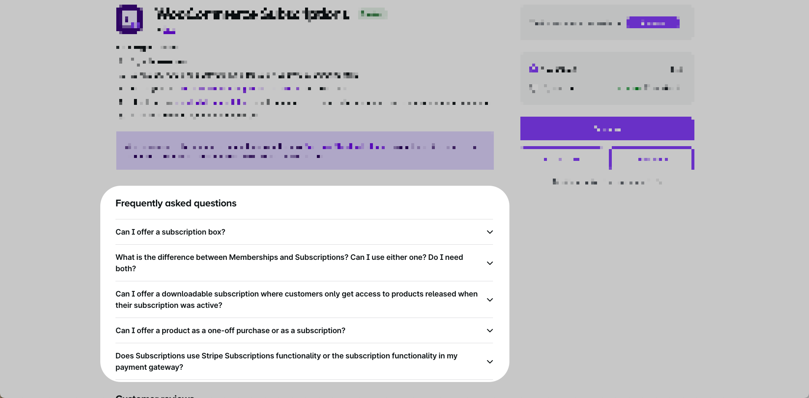

What to include in your FAQs

- **Usage highlights**: Think about what would appear on your product's packaging — describe how your product enhances user experience or solves common issues, but keep it brief. Add links to the documentation if longer text is needed.
- **Specific use cases**: Provide clear examples or scenarios demonstrating how customers can practically use your product.
- **Compatibility and prerequisites**: Clearly state any compatibility requirements or prerequisites. Does your product integrate seamlessly with other WooCommerce extensions or plugins?
- **Performance impact**: Address concerns customers might have about your extension's impact on their site's loading speed or overall performance.
- **Customer support encouragement**: Use the FAQ as an opportunity to reassure customers that they can always reach out to support if they have additional questions.
- **Troubleshooting and support access**: Include direct links or guidance for easily accessing troubleshooting guides and support resources.

What to avoid

- Highly technical instructions or step-by-step installation guides (these belong in your detailed documentation).
- Overly long or complicated answers: keep it concise and non-technical.
- Marketing language without substance — promotional phrases like "the best plugin ever!" FAQs should directly answer practical customer questions.
- Broad questions like "Why choose our extension?" Instead, provide specific details that users commonly inquire about.
- Lengthy explanations. Provide concise answers and link to documentation for detailed instructions.
- Excess formatting: For best legibility results, keep the styling and formatting of your paragraph down to a minimum. Writing everything in bold, CAPS, or italics doesn't help.

How to add FAQs to your product page

Go to the [Vendor Dashboard](https://woocommerce.com/wp-admin/edit.php?post_type=product) and edit the product page for one of your products.

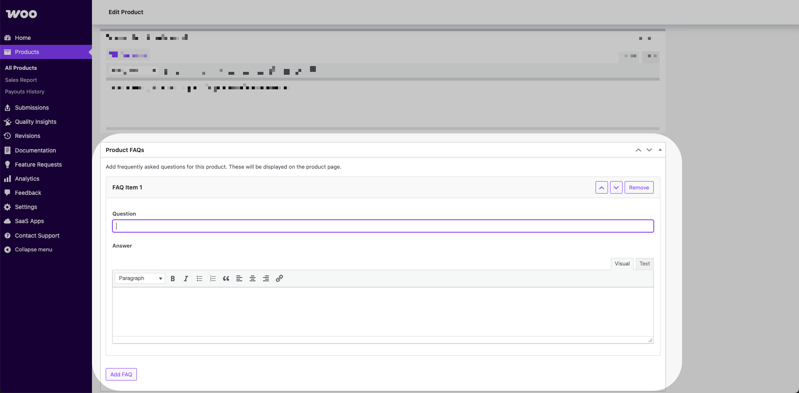

## Product data features

To lay a stronger foundation for search and category filters, we've added new product data fields. The new data points are used for product features, search keywords, and product compatibility.

While we're still exploring how they'll shape the broader search and categorization experience over time, these attributes will provide more control over how products appear in search results and which filters they match, leading to a more accurate and intuitive experience for customers.

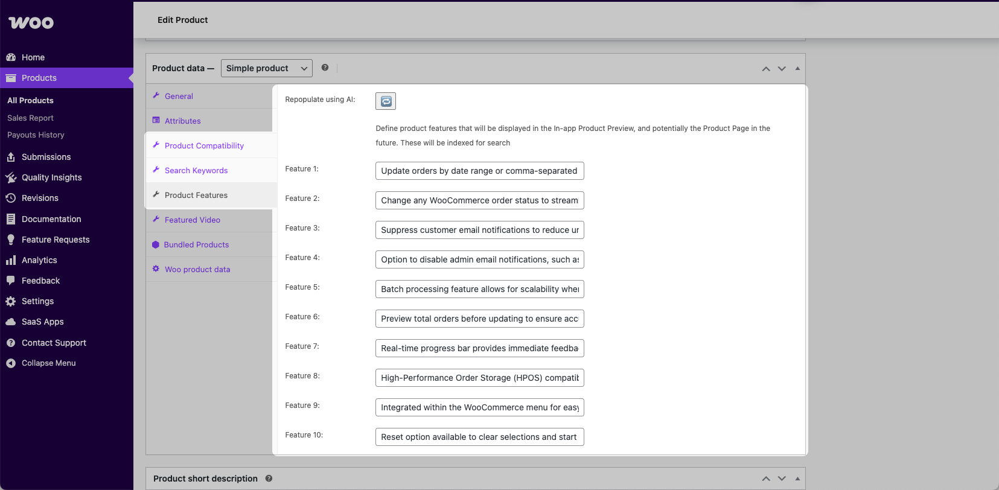

### What you need to know

- These data points have been auto-populated using AI as a first step. This helps streamline the process and gives you a starting point.
- We encourage you to review the AI-generated content to ensure it accurately reflects your product and make any updates needed.
- You'll see these fields in your product back-end when editing any of your products.
- These attributes are used in the In-app product previews (starting with WooCommerce 9.9). This means your shoppers benefit from richer, more informative previews of your products.

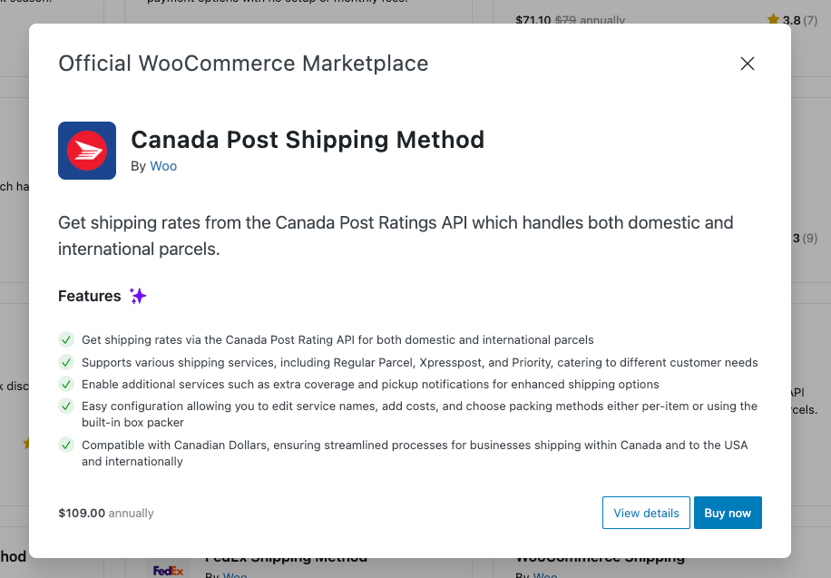

### Why this matters

- Customers will enjoy a cleaner, more relevant, and smoother shopping experience.
- Vendors will gain greater visibility and control over how their products are discovered.

## Listing requirements

**Requirements:** Product requirements can be added under the _Woo Product Data_ tab.

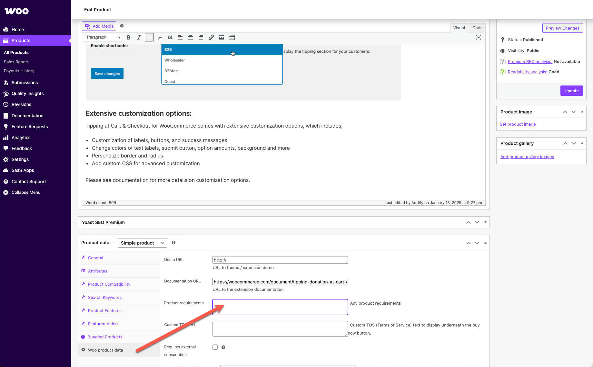

## Product name

### Naming guidelines

The product name is the first thing customers see when searching for products, so choosing an appropriate name is an important step. Choose a name that explains what your product does or why it's useful.

Tips for how to craft a good product name:

- **Brief** – Aim for 1 to 5 words, the fewer the better
- **Scannable** – Easy to understand
- **Unique** – Drives clicks to read more and makes it easier to find the listing via search
- **Customer focused** – Use your customers' words rather than your own

The name should NOT:

- Violate trademark guidelines of WooCommerce or any other brand name.
- Be a description of your product; use the short description to highlight the main benefits.
- Use adjectives like "best" or "amazing"
- Closely copy an existing listing name.

### Changing a product's name

To have the name of a product changed, please get in touch with the Woo Marketplace team via your Vendor Dashboard.

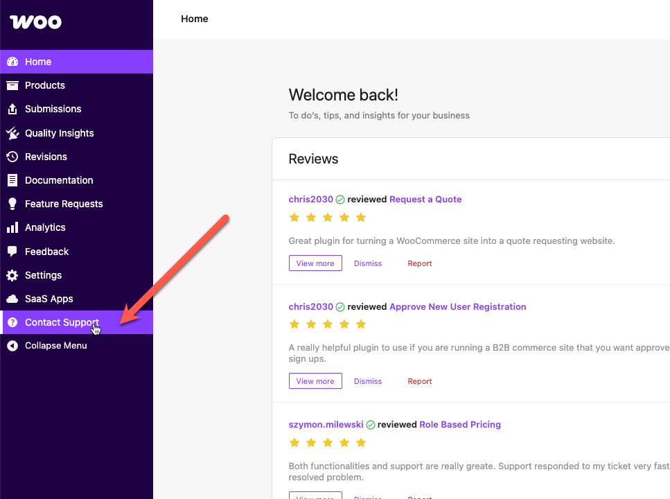

## Product price

To have the price of a product changed, please get in touch with the Woo Marketplace team via your Vendor Dashboard.

## Demo

Providing product demos of your WooCommerce extension is important — it helps potential customers quickly understand how your product works, what features it offers, and how it can benefit their store. A demo builds trust, reduces hesitation, and can significantly increase conversions by showing the value of your extension in action.

Here are 3 things to make sure you include in your demo setup:

- **Show both front-end and back-end views** – Give users a complete picture of how the extension works from a store owner's and a customer's perspective.
- **Use secure (HTTPS) links** – This ensures user safety and builds trust when they visit your demo site.
- **Link directly to relevant pages** – Let users experience the extension in action without having to click around or guess where to go.

To add a link to your demo, when editing a product, go to the _Woo product data_ tab and find the _Demo URL_ field.

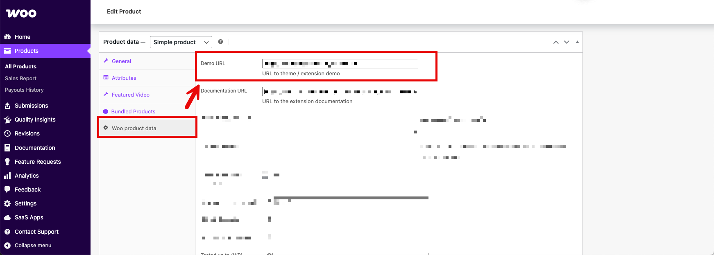
