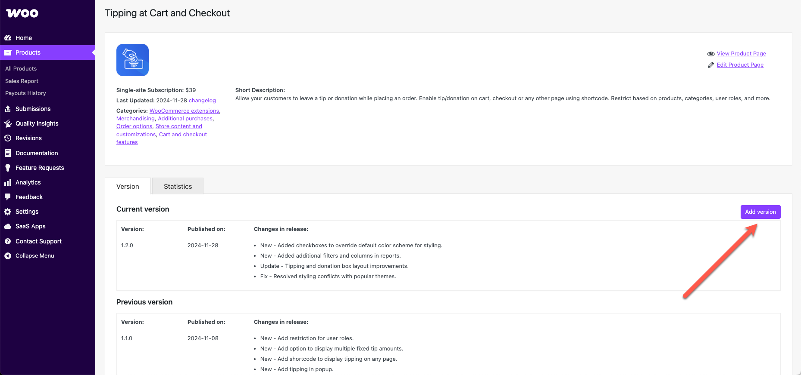
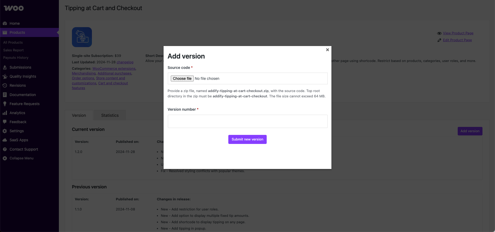
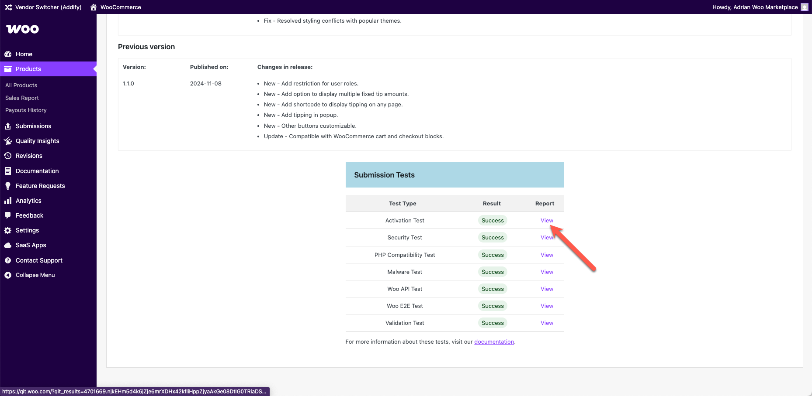

# Product update guidelines and best practices

To maintain a high-quality and competitive Marketplace, we encourage all vendors to regularly update their products. Consistent updates ensure compatibility with the latest versions of WooCommerce and WordPress, improve security and performance, and deliver ongoing value to customers.

## Best practices

### TL;DR

- Update your product at minimum **every 6 months**.
- Align with the [WooCommerce core release calendar](https://developer.woocommerce.com/release-calendar/).
- Use tools such as the [Quality Insights Toolkit](https://qit.woo.com/) (QIT) and your **vendor dashboard**.
- Check the [feature request portal](https://woocommerce.com/document/feature-request-portal/) for product ideas.
- Regular updates = better customer trust and renewal rates.

## Why regular updates matter

- **Compatibility**: Ensures your product works seamlessly with the latest WooCommerce and WordPress releases.
- **Security**: Patches vulnerabilities and keeps customer sites secure.
- **Performance**: Enhances speed, reliability, and efficiency.
- **Customer trust**: Builds confidence in your brand and product longevity. Regularly updated products often see higher renewal rates. Each update is a reminder of the value of keeping a subscription.
- **Support load reduction**: Reduces the number of support tickets by proactively addressing issues.

### Recommendations

1. **Monitor the [WooCommerce release calendar](https://developer.woocommerce.com/release-calendar/)**: Anticipate changes that might impact your product.
2. **Engage customer feedback**: Use reviews, support tickets, and feature requests to inform improvements, new features, and community-requested improvements.
3. **Use semantic versioning**: Example: `v2.1.0` for features, `v3.0.0` for breaking changes.
4. **Test thoroughly**: Ensure updates are stable and backward-compatible where possible. Consider integrating the [Quality Insights Tool](https://qit.woo.com/docs/) (QIT) into your workflow to automatically detect potential issues.
5. **Document changes transparently**: Maintain clear, customer-facing changelogs, update the documentation and the product page if needed.

### Marketplace expectations

Products that fail to stay current with WooCommerce core and/or those that are not updated at least once every six months will be **flagged for removal** from the WooCommerce Marketplace.

### Recommended update cadence

- **Major releases**: At least quarterly, to align with [WooCommerce core releases](https://developer.woocommerce.com/release-calendar/).
- **Security fixes**: As needed, with urgency.
- **Minor improvements**: Monthly or as features and fixes are ready.
- **Documentation**: Keep changelogs and user guides current with each release.

## How to deploy updates

### Uploading new versions

Before uploading a new version of your extension, it is important to ensure that it passes all QIT quality standards. You can run these checks from your vendor dashboard by clicking the **_Quality Insights_** menu option.

[Learn more about QIT tests and how to run them](https://qit.woo.com/docs/).

You can upload the updated version after your extension passes all QIT checks.

Click the **Versions** tab. You'll see all the versions you've previously uploaded, including highlights about what was in each version.



Click the **Add version** button, then:

1. **Select the .zip file** you want to upload from your computer.
2. **Add the version number**.
3. Click **Submit new version**.

Once submitted, we will run the following tests on the uploaded file:

- [End-to-end](https://qit.woo.com/docs/managed-tests/woo-e2e) (E2E)
- [Activation](https://qit.woo.com/docs/managed-tests/activation)
- [Security](https://qit.woo.com/docs/managed-tests/security)
- [Woo API](https://qit.woo.com/docs/managed-tests/woo-api)
- [PHPCompatibility](https://qit.woo.com/docs/managed-tests/phpcompatibility)
- [Malware](https://qit.woo.com/docs/managed-tests/malware)

All vendor admins will receive email notifications throughout the process, including:

- **Confirmation:** Vendor admins will receive an email when a new version is submitted, confirming that it is in the queue. No action is needed.
- **Rejected:** If a version fails any part of our automated testing, vendor admins will receive an email including the specific error. Developers should try to resolve the error and submit a new version when ready.
- **Live:** If a version passes automated testing, it will be automatically deployed and made available to customers. No action is needed.

Activation, security, and malware test passes are required for a new product version to be deployed.

#### Formatting the changelog

[Learn more about changelog formatting and entry types](https://developer.woocommerce.com/docs/extensions/core-concepts/changelog-txt/#the-changelogtxt-file).

#### Common errors

If an upload fails, there are a few common errors you should check first:

- **The name of the file:** WooCommerce.com looks for a specific name for your .zip file and the main folder within it. You will see the expected name when you try to upload a product:



- **A changelog is present**: A file named `changelog.txt` must be present to serve as a record of what's changed from version to version.
- **Invalid changelog:** The `changelog.txt` file provided does not match the expected format.
- **Mismatched version header**: The version in the extension header does not match the version provided during the upload process.
- **Mismatched version numbers:** The version in the extension header and the `changelog.txt` do not match.

#### Viewing test results

The results from the automated tests will be in the **Submission Tests** table, which can be viewed by clicking the associated **View** link as shown in the image below:



### Programmatically uploading new versions

To deploy an extension programmatically, it must be an extension update and **not** a new submission. This method serves as an alternative to logging into the vendor dashboard and using the user interface (UI) to perform the same action.

#### Generating an application password

1. Ensure that you are logged into your WooCommerce vendor dashboard.
2. [Create an application password](https://woocommerce.com/wp-admin/authorize-application.php?app_name=WCCOM+Product+Submissions&app_id=c08e8963-897b-46cd-91e9-e92488ac9120).

:::note
For extra security, this application password is scoped to the deploy endpoint and cannot be used to perform any other action on the user's behalf.
:::

#### Deploying your product

Make a POST request to deploy your product using the following command:

```bash
curl -X POST https://woocommerce.com/wp-json/wc/submission/runner/v1/product/deploy \
  -F "file=@/path/to/zip" \
  -F "product_id=<product_id>" \
  -F "username=<username>" \
  -F "password=<app_password>" \
  -F "version=<product_version>"
```

Replace `<product_id>`, `<username>`, `<app_password>`, and `<product_version>` with your actual product ID, username, application password, and product version, respectively.

#### Checking deployment status

To check the status of your deployment, use the following command:

```bash
curl -X POST https://woocommerce.com/wp-json/wc/submission/runner/v1/product/deploy/status \
  -F "product_id=<product_id>" \
  -F "username=<username>" \
  -F "password=<app_password>"
```

#### Status response

When you query the deployment status, the response will provide details about the progress, including the status of various test runs.

Below is an example of this response:

```json
{
  "status": "queued",
  "version": "1.0.0",
  "test_runs": {
    "12345": {
      "test_run_id": "12345",
      "status": "success",
      "test_type": "activation",
      "result_url": "https://qit.woo.com/?qit_results=12345"
    },
    "67890": {
      "test_run_id": "67890",
      "status": "success",
      "test_type": "api",
      "result_url": "https://qit.woo.com/?qit_results=67890"
    }
  }
}
```

> **Note:** Additional test run objects may be present in the response, one for each test type that was executed.

### Maximize compatibility and reliability via custom E2E tests

We strongly encourage contributing E2E tests for your extensions built on top of the QIT's [custom E2E testing framework](https://qit.woo.com/docs/custom-tests/introduction). By sharing these tests with us, you play a crucial role in ensuring true compatibility across different WordPress and WooCommerce versions, various PHP environments, and alongside other popular extensions.

Our custom E2E testing framework — equipped with a Dockerized development environment and simple-to-use command tools — empowers you to design and execute comprehensive tests using [Playwright](https://playwright.dev/) that are tailored to your extension's unique functionalities.

Not only does this initiative help mitigate potential compatibility issues before they affect users, but it also enhances the overall reliability of the products within our marketplace. Participating in this process not only contributes to a robust ecosystem but also elevates your extension's reputation for quality and reliability.

Review our [QIT custom test documentation](https://qit.woo.com/docs/custom-tests/introduction) to begin leveraging the power of custom tests to guarantee your extension works seamlessly in real-world scenarios and stands out in the competitive Marketplace.

## Need help?

Feel free to reach out to the Marketplace team for update planning, QIT help, or deployment issues.

Let's work together to keep the WooCommerce.com Marketplace innovative, secure, and reliable for everyone!
