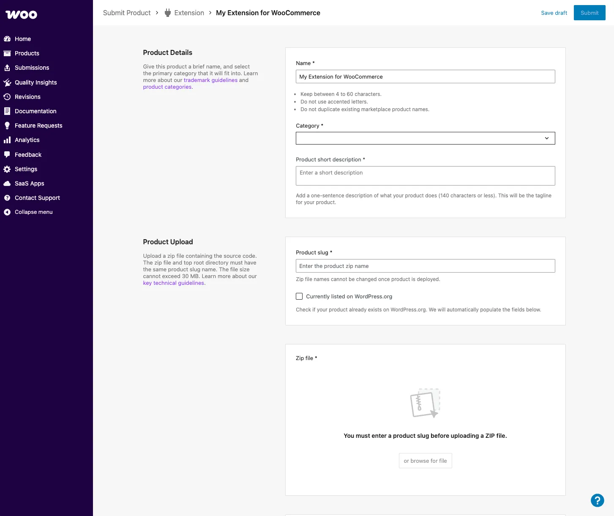
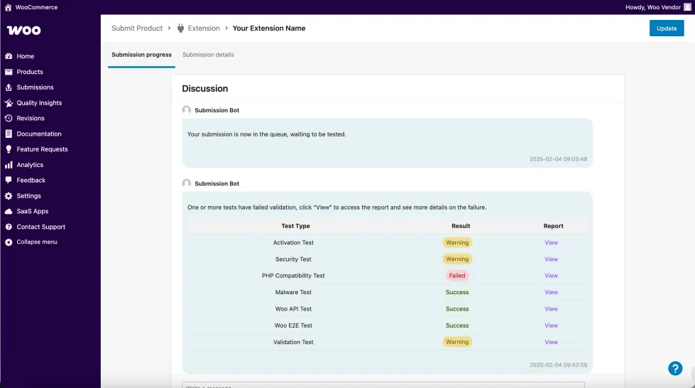
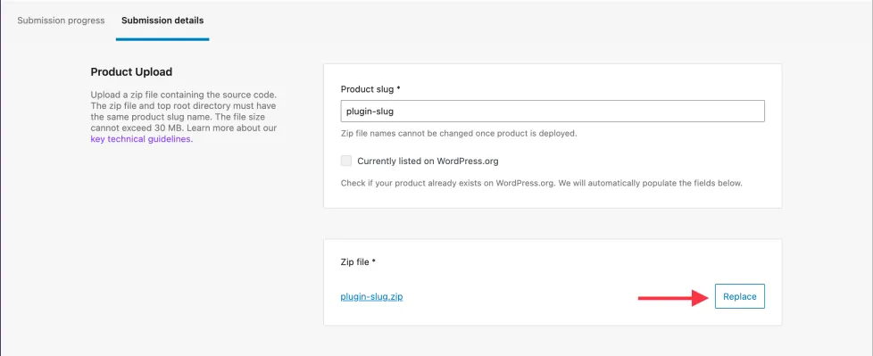
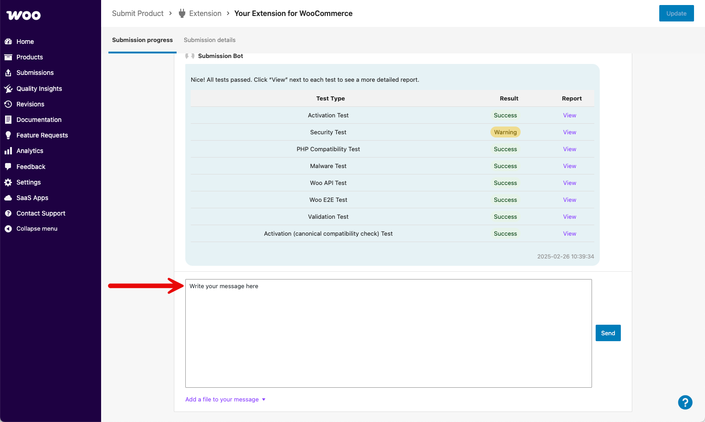

# Submitting your product to the Woo Marketplace

We look forward to reviewing your extension, theme, or integration for listing in the WooCommerce.com Marketplace. Before getting started, make sure you have [signed up for a vendor account](https://woocommerce.com/partners/), and are logged into your [vendor dashboard](https://woocommerce.com/wp-admin/).

## Pre-submission checklist

Business review

This includes an analysis of the product's business model and revenue share structure with Woo, as well as product rationale, competition, and developer/company history.

- **Mutually beneficial partnership**: Products must share revenue with Woo, exclude spam links, affiliate links, or links to upsell products outside of the Woo Marketplace. See our [monetization expectations](./monetization-expectations.md).
- **Trademark compliance**: Ensure that product names do not violate Woo's [trademark guidelines](https://woocommerce.com/trademark-guidelines/#sg-trademarks). Select a unique name that builds your brand and sets your product apart from others. [Review our product name guidelines](https://woocommerce.com/document/product-page-content-and-assets/#section-14).
- **Competitive pricing**: Is the proposed price equal to or less than the price of the product sold in other environments? Select a suggested price that matches the price you sell elsewhere.

Development guideline compliance

- Products must follow [security best practices](https://developer.wordpress.org/apis/security/).
- Products must support PHP 7.4+ as a minimum (PHP 8.3+ strongly recommended).

:::warning PHP 7.4 End of Life
PHP 7.4 reached [End of Life](https://www.php.net/supported-versions.php) (EOL) in November 2022. Using it may expose sites to security vulnerabilities.
:::

- Products must support the two latest **major releases** of both [WooCommerce](https://wordpress.org/plugins/woocommerce/) and [WordPress](https://wordpress.org/download/).
- Products must adhere to foundational guidelines outlined in our [developer hub](https://developer.woocommerce.com/).
- If your pricing model is based on a standard, tiered monthly subscription, we require you to implement the [SaaS Billing API](https://woocommerce.com/document/billing-api-for-saas-products/). API keys and sandbox access are granted manually after products are submitted for Marketplace consideration.
- Products must be able to pass the following [Quality Insights Toolkit](https://qit.woo.com/docs/) (QIT) tests:
    - [API](https://qit.woo.com/docs/managed-tests/woo-api)
    - [End-to-end](https://qit.woo.com/docs/managed-tests/woo-e2e) (E2E)
    - [Activation](https://qit.woo.com/docs/managed-tests/activation)
    - [Security](https://qit.woo.com/docs/managed-tests/security)
    - [PHPCompatibility](https://qit.woo.com/docs/managed-tests/phpcompatibility)
    - [Malware](https://qit.woo.com/docs/managed-tests/malware)
    - [Validation](https://qit.woo.com/docs/managed-tests/validation)

User experience compliance

- The product review includes a deeper analysis of the product's user experience (UX) and user interface (UI).
- Ensure that your product's [critical flows](https://developer.woocommerce.com/testing-extensions-and-maintaining-quality-code/critical-flows/) have been thoroughly tested. See an example of [critical flows in the core WooCommerce plugin](https://developer.woocommerce.com/docs/contribution/testing/core-critical-flows/).
- Extensions must adhere to [development best practices](https://developer.woocommerce.com/docs/extensions/best-practices-extensions/extension-development-best-practices/) and [UX guidelines](https://developer.woocommerce.com/docs/extensions/ux-guidelines-extensions/).
- Themes must adhere to [theme development](https://developer.woocommerce.com/docs/theming/block-theme-development/theming-woo-blocks/), [design](https://developer.woocommerce.com/docs/user-experience-guidelines/ux-guidelines-themes/), and [UX guidelines](https://developer.woocommerce.com/docs/user-experience-guidelines/ux-guidelines-themes/).
- **Accessibility**: It is important that all customers can use the stores where your extension is installed. Extension submissions must meet the [WordPress Accessibility Coding Standards](https://developer.wordpress.org/coding-standards/wordpress-coding-standards/accessibility/). For more information, review WordPress's [accessibility quick start guide](https://make.wordpress.org/accessibility/handbook/best-practices/quick-start-guide/).
- Does the product have a single core purpose and use WooCommerce features as much as possible?
- Can the product function "out of the box" without much configuration?

Compatibility with top Woo extensions

Products should not cause issues with widely-used Marketplace extensions. If your product is found to break any of these extensions when installed alongside them, it may be rejected or removed from the Marketplace.

Popular extensions include:

- [WooCommerce Bookings](https://woocommerce.com/products/woocommerce-bookings/)
- [WooCommerce Subscriptions](https://woocommerce.com/products/woocommerce-subscriptions/)
- [Product Add-Ons](https://woocommerce.com/products/product-add-ons/)
- [Product Bundles](https://woocommerce.com/products/product-bundles/)
- [Min/Max Quantities](https://woocommerce.com/products/minmax-quantities/)
- [Shipment Tracking](https://woocommerce.com/products/shipment-tracking/)

Compatibility with core WooCommerce features

Visitors expect the WooCommerce.com Marketplace to be the leading source of extensions and themes for the optimal ecommerce experience. This means we only accept submissions which are compatible with the latest enhancements to the core WooCommerce platform and overall merchant experience.

[Review Woo's public roadmap](https://developer.woocommerce.com/roadmap/) for primary initiatives and expectations.

Block editor compatibility

As we evolve within the WordPress ecosystem, we're placing a strong emphasis on block editor compatibility for WooCommerce extensions. While we continue to support classic and hybrid approaches, prioritizing block editor compatibility ensures your extensions align with the latest trends and offer users a more intuitive and cohesive experience.

- **Cart and Checkout blocks**: The block-based Cart and Checkout is now the default experience in WooCommerce, offering a more streamlined and visually cohesive shopping experience. As a developer, prioritizing compatibility with these default blocks ensures your extensions and themes seamlessly integrate with the enhanced default shopping flow. [Review Cart and Checkout block architecture](https://developer.woocommerce.com/2023/09/18/architecture-of-cart-and-checkout-blocks/).
- **Extensions**: Eliminate shortcode dependency. Many plugins/extensions still rely on shortcodes to output content. To enhance block editor compatibility, it is essential that these shortcodes are provided as blocks. This not only future-proofs your product but also allows users to leverage the full potential of the block editor's capabilities.
- **Themes**: While we continue to accept classic and hybrid themes, we are **prioritizing block themes** for the Woo Marketplace. Block themes are designed to fully leverage the capabilities of the block editor and provide users with a more intuitive and flexible content creation experience.

HPOS compatibility

High-Performance Order Storage (HPOS) is the **default experience for new WooCommerce stores**. It moves order data from the WordPress post and postmeta tables to dedicated order tables to improve scalability and reliability.

:::info
**All new extension submissions must be HPOS-compatible.** View our [HPOS recipe book](https://developer.woocommerce.com/docs/hpos-extension-recipe-book/) for ways to support HPOS in your product.
:::

## Submitting a product for review

From your vendor dashboard, navigate to **Submissions > Submit Product** and select the product type you're planning to submit:

- Extension
- Theme
- SaaS
- Business Service

:::note Freemium products
Freemium products — products with both free and paid versions — require **two separate submissions**, one for each model. These will later be merged into a single product page where users can choose between versions.
:::

### File upload and submission info

The information required varies slightly depending on the submission flow selected. To help streamline the submission process, we only ask for critical details:

- Product upload
- Business details
- Testing instructions

Next, **address any submission test failures** noted in the discussion dialog. In the event of failures — marked as *Failed* — please click the **View** link beside the failed test to review the results and upload a modified version of your submission.

If necessary, **replace the previously uploaded file to test again.** When tests fail, the submission status updates to ***Changes required***.

To proceed, click the **Replace** button to replace the current .zip file with a corrected version. This will automatically restart the testing process.

:::tip
If your product is at a stage other than *Changes required*, you will not be able to replace this file. Please comment within the submission to request a status change from the Marketplace team.
:::

## Review process

Once the submitted product passes automated code tests, it moves to our review queue. Once it has been reviewed, the reviewer will share feedback (if any) with you.

A review consists of the following steps:

1. **Business review**: to ensure your product is a good fit for the Marketplace, and that there is a business model to share revenue.
2. **Code review**: to ensure the submitted product's code is original, secure, and aligned with overall WordPress and WooCommerce quality standards.
3. **User experience (UX) review**: to ensure the product works as expected and its look and feel aligns with our UX guidelines.
4. **Launch preparations**: once a submission successfully passes these review phases, it will be formally approved and proceed to onboarding for launch.

## FAQs

How long will it take for my product to be reviewed?

Once the submission is in business review, you can expect a formal decision from a reviewer within 30 days. Throughout the review process, we may provide feedback and request changes before rejecting or approving a submission.

Can I submit multiple products at once?

Yes. If you are planning to submit multiple products, it's best to submit them all at once. This allows us to prioritize those that are most likely to be approved faster from those that might require additional work.

Can I resubmit a previously rejected product?

Yes. You are welcome to resubmit products, providing the previously-received feedback was incorporated and your product was improved to comply with our guidelines and quality standards.

## Submission support

For additional questions related to your submission, please use the discussion box below the **Submission Bot** results table in the **Submission progress** tab within your vendor dashboard.

