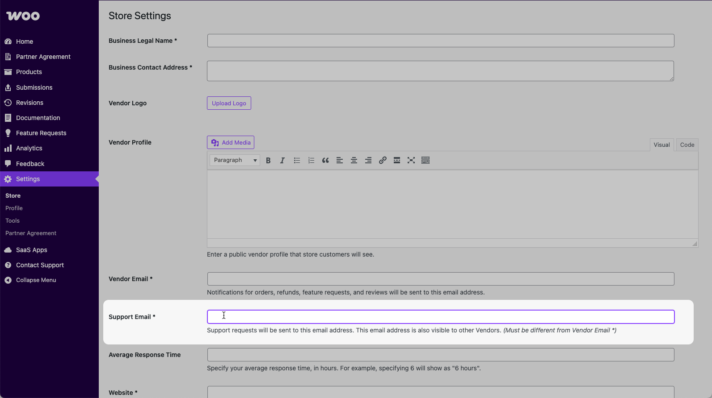
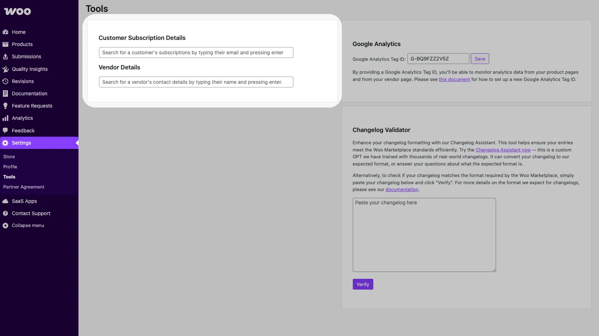
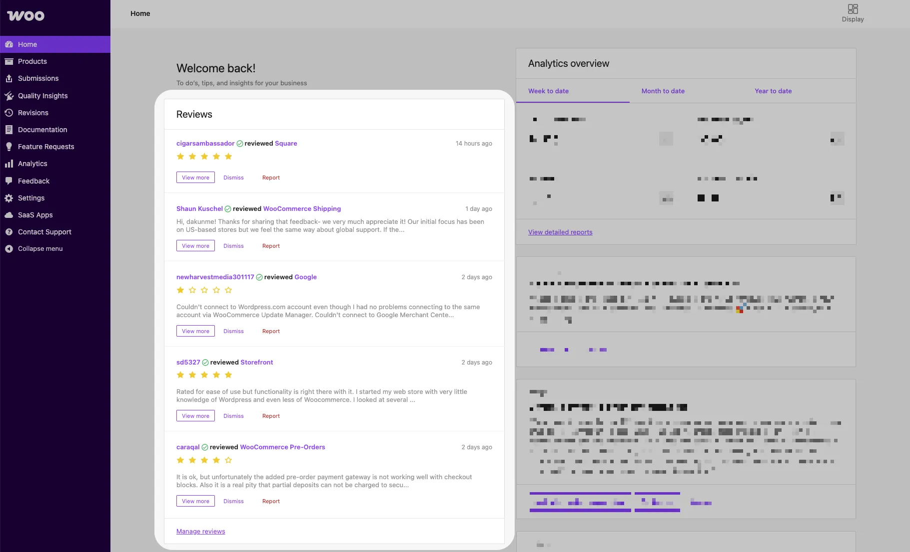
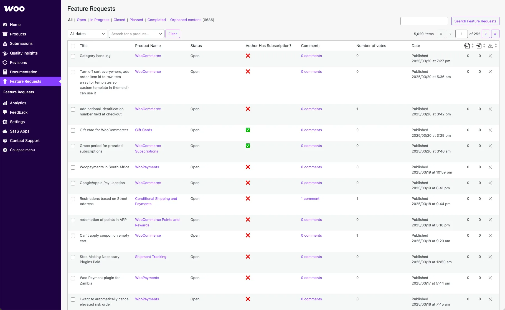

# Support guidelines for the Woo Marketplace

Adhering to the support expectations outlined in this guide is a requirement under the Marketplace Vendor Agreement. Failure to meet these expectations may result in temporary or permanent removal of your products from the Marketplace.

By participating in the WooCommerce.com Marketplace, you're not just selling a product — you're offering a complete customer experience. Providing timely, high-quality support is a core part of that experience and a key factor in building long-term trust with your customers.

That said, great support is not only a requirement — it's a growth opportunity. Providing excellent support boosts customer loyalty, increases positive reviews, encourages repeat purchases, and strengthens your reputation in the Marketplace, ultimately contributing to your long-term growth and profitability.

## Support expectations

Marketplace vendors are responsible for customer support in line with WooCommerce's Support Policy, including:

- Timely responses to customer emails.
- Handling customer reviews and ratings promptly.
- Managing feature requests posted on product pages.

The WooCommerce team supports vendors by managing account issues, refunds, coupons, escalations, and live chat queries.

### Response times

Timely responses are critical. If you are unavailable or expect delays, communicate this clearly with the WooCommerce team and arrange to redirect support requests appropriately.

### Support ratings

Customers can rate their support experience seven (7) days after submitting a ticket. Maintaining good support ratings is crucial for continued Marketplace participation.

### Live chat

Marketplace vendors provide support exclusively via email. WooCommerce handles live chat queries and redirects product-specific requests to a vendor's support email address.

## How support works

### Ticket routing

Customers submit tickets through the support request form and are automatically routed to your designated support email address. Each support email includes:

- Product name
- Subscription dates
- System status report
- The customer's message.

### Specifying your support email address

Specify the email address that support tickets should be routed to in your vendor dashboard via _Settings > Store_. The WooCommerce team will also use this address to copy (CC) you in on tickets.

:::note
The Support Email field is different from Contact Email, which is used for order notifications.
:::

### Getting set up for support ticket replies

- **Activate an autoresponder**: Automatically inform customers that you have received their request, including links to your privacy and data usage policies. Avoid promotional or affiliate links.
- **Deactivate any platform feedback requests**: Customers already receive feedback requests from the Woo Marketplace directly.

## Security and customer login credentials

If you need to log in to a merchant's store in order to successfully assist them, please follow these guidelines:

- **Only ask for login credentials once you have exhausted all other options.** This includes asking for screenshots and reproducing the problem on your own test site(s).
- **When asking for login credentials:**
    - Inform the customer that, under GDPR regulations, they must mention that they may need to give access to third-party support services in their store's terms and conditions.
    - Always ask the customer to create a temporary administrator account for you. (You will need to tweak the instructions in the document linked above as you do not have access to `woologin@woocommerce.com`.)
    - At the end of the support interaction, ask the merchant to remove this temporary account.
- **If the customer shares their details before you are able to provide the instructions above**, always point out that they ideally don't do this and that you strongly advise them to reset their password.
- **Never ask for plain-text passwords.** Instead, use a password-sharing service like [QuickForget.com](https://quickforget.com/) to create a unique, expiring link.

## Collaboration, refunds, and escalations

To collaborate with other Marketplace vendors, you can copy in (CC) relevant parties on support tickets. Contact information for other vendors is available from the WooCommerce team.

All refunds, coupons, and escalations are managed by WooCommerce. Forward relevant tickets by CCing the private email address from the Marketplace Developer P2.

## Marketplace support tools

### Active subscription checks

Subscription details are included in customer support emails. Additional checks can be done through your vendor dashboard via _Settings > Tools_.

### Reviews and ratings

Vendors are expected to monitor and respond to customer ratings and reviews as part of their support responsibilities. Addressing concerns promptly not only improves customer satisfaction but also demonstrates your commitment to quality service.

Keep in mind that customers are significantly more likely to leave a positive review following a helpful and timely support experience. Engaging positively with customer feedback — both praise and criticism — can strengthen your product reputation and foster long-term trust.

Reviews and ratings for your products are managed via your vendor dashboard.

### Feature requests

Customers can post feature requests via your product page. These requests are publicly visible and provide valuable insight into what users want from your product.

Vendors are expected to regularly monitor and respond to these requests like any other support channel. Timely, thoughtful engagement with feature requests demonstrates that you value user input and are actively working to improve your product.

Feature requests are a powerful tool for understanding how customers use your product, identifying common pain points, and shaping your product roadmap. By participating in these conversations, you can build trust and stay aligned with your customers' evolving needs.

Feature requests for your products are managed in your vendor dashboard via _Feature Requests_.

